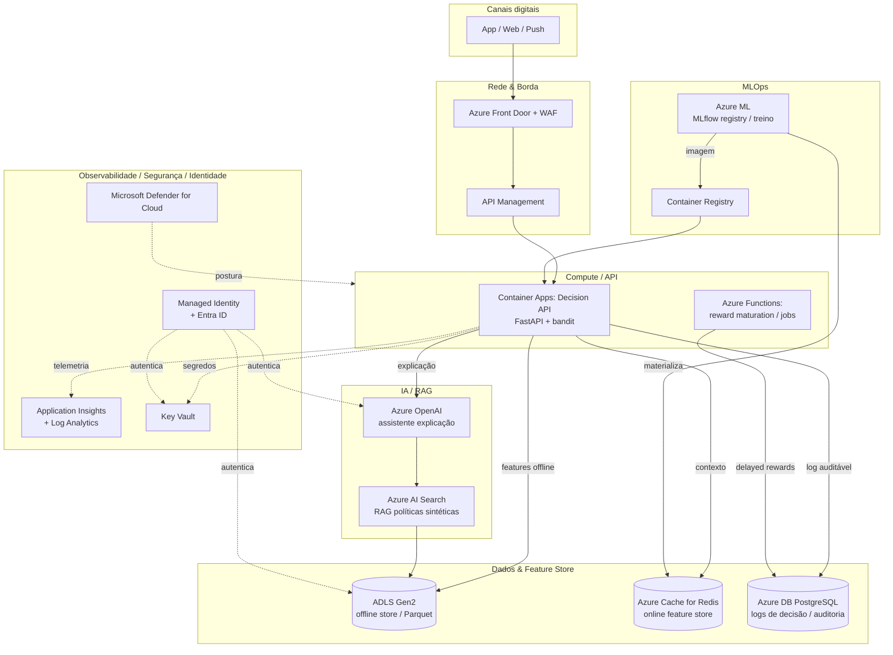

# Arquitetura-alvo Azure (Etapa 6)

> Como a plataforma seria **operada em produção na Azure**, usando
> **exclusivamente** serviços Azure. Diagrama Mermaid + mapeamento de serviços +
> plano de deploy, segredos e FinOps. Não depende de outro provedor de nuvem.

## 1. Diagrama de arquitetura

## 2. Mapeamento de serviços por camada

| Camada | Serviço Azure | Papel | Alternativa descartada |
|---|---|---|---|
| **Compute/API** | **Container Apps** | Hospeda a Decision API (FastAPI), escala a zero | AKS (overhead operacional alto p/ o porte); App Service (menos flexível p/ jobs) |
| Jobs | **Azure Functions** | Maturação de *delayed rewards*, retreino agendado | — |
| **API gateway** | **API Management** + **Front Door/WAF** | Rate limit, auth, TLS, borda global | Exposição direta (sem WAF) descartada por segurança |
| **Dados offline** | **ADLS Gen2** | Offline feature store (Parquet), golden set | Blob puro (sem hierarquia/ACL) |
| **Feature store online** | **Azure Cache for Redis** | Leitura de features < 5 ms no serving | SQLite local (não escala em prod) |
| **Auditoria/logs** | **PostgreSQL Flexível** | Log de decisão (reason codes, versão) | Cosmos DB (custo maior p/ relacional) |
| **IA/RAG** | **Azure OpenAI** + **AI Search** | Assistente de explicação + recuperação de políticas | LLM externo (viola "exclusivamente Azure") |
| **MLOps** | **Azure ML** (+ MLflow) + **ACR** | Registry de políticas, treino, imagens | MLflow self-hosted (mais operação) |
| **Observabilidade** | **Application Insights + Log Analytics** | Telemetria, métricas de drift/reward, alertas | — |
| **Segurança/Identidade** | **Key Vault + Managed Identity + Entra ID + Defender** | Segredos, identidade sem senha, postura | Segredos em env var (descartado) |

## 3. Gestão de segredos e credenciais

- **Zero segredos em código/imagem.** Todas as credenciais (Azure OpenAI, Redis,
  PostgreSQL, Kaggle) ficam no **Key Vault**.
- **Managed Identity** (system-assigned) do Container App autentica em Key Vault,
  ADLS, Redis e Azure OpenAI via **Entra ID** — sem chaves estáticas.
- Rotação automática de segredos; referências via `@Microsoft.KeyVault(...)` nas
  configs do Container App. O `.env.example` lista as variáveis equivalentes
  locais (preenchidas via Key Vault em prod).

## 4. Plano de deploy

1. **Build & push**: GitHub Actions (`cd.yml`) builda a imagem e publica no **ACR**.
2. **Provisionamento**: IaC (Bicep/Terraform) cria RG, Container Apps Env, Redis,
   ADLS, PostgreSQL, Key Vault, AI Search, Azure OpenAI, App Insights.
3. **Deploy**: revisão nova do Container App aponta para a tag de imagem; tráfego
   migrado por *revision split* (canary 10% → 100%).
4. **Materialização**: job do Azure ML materializa features no Redis e registra a
   política no MLflow registry (Azure ML).
5. **Rollback**: *revision split* volta para a revisão anterior; ponteiro de
   política reverte para a versão anterior (ver `docs/mlops-lifecycle.md`).

## 5. FinOps (ROI, custo qualitativo, TCO, escala)

| Serviço | Driver de custo | Escala ↑ (mais requisições) | Redução ↓ |
|---|---|---|---|
| Container Apps | vCPU-s / req | escala horizontal automática | **escala a zero** fora de pico |
| Azure OpenAI | tokens (só explicações) | cache de respostas; explicar sob demanda | desligar assistente em baixa demanda |
| Redis | tier/memória | tier maior só no pico | tier básico fora de pico |
| PostgreSQL | armazenamento/IOPS | retenção/particionamento de logs | retenção curta + arquivamento em ADLS |
| AI Search | tier/índice | réplicas no pico | tier free/básico p/ corpus pequeno |

- **ROI**: o ganho medido (+66,6% de valor vs baseline em simulação) sobre o
  volume de impressões dilui o custo de compute/LLM rapidamente; o LLM é usado
  **apenas** para explicação/governança (custo marginal).
- **TCO**: dominado por Container Apps + Azure OpenAI; Redis/PG/Search são
  secundários no porte do protótipo. Escala a zero e cache de explicações são as
  duas maiores alavancas de redução.
- **Cenários de escala**: pico de campanha → réplicas de Container Apps + tier
  Redis maior + cache de RAG; vale → escala a zero, tier básico, assistente
  sob demanda.

## 6. Cobertura de camadas (checklist Etapa 6)

- [x] Compute (Container Apps) · [x] API (APIM/Front Door)
- [x] Dados (ADLS, Redis, PostgreSQL) · [x] IA/RAG (Azure OpenAI, AI Search)
- [x] Observabilidade (App Insights/Log Analytics)
- [x] Segurança (Key Vault, Defender) · [x] Identidade (Managed Identity/Entra ID)
- [x] Governança (MLflow registry, auditoria, model/system cards)
