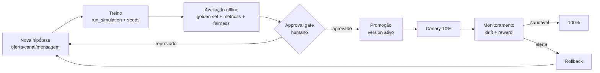

# Ciclo de Vida MLOps (Etapa 7)

> Como novas políticas são **testadas, aprovadas e promovidas** para produção
> controlada, com versionamento, *approval gate*, rollback, monitoramento de
> *drift*/recompensa e rastreio de experimentos.

## 1. Visão geral do ciclo

## 2. Rastreio de experimentos (MLflow)

- Cada `adaptive-offers train` abre um **run MLflow** (`src/adaptive_offers/tracking.py`)
  e registra params (política, horizonte, seed) e métricas (reward, regret_ratio,
  conversão, exploração).
- Tracking URI configurável (`MLFLOW_TRACKING_URI`); em Azure aponta para o
  registry do Azure ML. Comparar runs é como comparamos baseline × adaptativas.

## 3. Versionamento e registro de políticas

- `policy.versioning` salva cada política treinada em
  `artifacts/policies/<version>/` com `metadata.json` (config, métricas, hash de
  conteúdo) e mantém um **registry** (`registry.json`) com `active` + `history`.
- `promote(version)` torna uma versão ativa; `rollback()` volta para a anterior.

## 4. Critérios de promoção (approval gate)

Uma política só é promovida se **todos** os critérios passarem:

| Critério | Limite |
|---|---|
| Golden set pass-rate | ≥ 0,95 e **100% dos casos adversariais** |
| Lift de valor vs versão ativa | ≥ 0 (não regredir) |
| Regret ratio | ≤ regret da versão ativa |
| Fairness (disparidade de exposição) | ≤ 0,25 |
| Sensibilidade (CV de reward sobre seeds) | ≤ 5% |
| Revisão humana | aprovação registrada (nome + data) |

O *gate* é **humano no loop**: a automação calcula evidências; uma pessoa aprova.

## 5. Procedimento de promoção (controlado)

1. Treinar candidato `vN` e avaliar (`evaluate`) — evidências em `artifacts/`.
2. Revisor confere golden set, lift, fairness e o **model card**.
3. Aprovação registrada → `promote("vN")`.
4. **Canary** 10% (revision split no Container App) com monitoramento ativo.
5. Saudável por janela definida → 100%. Alerta → `rollback()` automático.

## 6. Monitoramento

- **Drift** (`monitoring/drift.py`): PSI (bandas 0,10 / 0,25) + KS por feature e
  pelo *score* da política. PSI ≥ 0,25 → `retrain_recommended`.
- **Reward/conversão** (`monitoring/reward_monitor.py`): *control chart* (z-score
  em janela móvel). Queda sustentada (z < −3) → `rollback/review`.
- **Relatório HTML** (`monitoring/report.py`): `adaptive-offers monitor` gera
  `artifacts/monitoring/drift_report.html` (tabela PSI/KS + distribuições Plotly +
  saúde da recompensa + fairness). Integra **EvidentlyAI** se instalado
  (`pip install "adaptive-offers[monitoring]"`); senão produz um relatório
  autossuficiente — sempre funciona, sem dependência dura em CI.
- Telemetria em Application Insights; alertas disparam o *gate* de retreino.

## 7. Plano de retreino

- **Gatilhos**: drift significativo, queda de reward, cadência mínima (ex.: mensal),
  ou nova hipótese de oferta/canal.
- **Pipeline**: `data build → synth generate → train → evaluate → approval → promote`.
- **Rollback**: 1 comando (`rollback()`) reverte o ponteiro ativo; decisão volta
  a baseline/humano enquanto se investiga (ver `docs/system-card.md`).

## 8. Riscos operacionais cobertos

- *Reward hacking* / manipulação de contexto → gates de elegibilidade + monitor de
  reward + revisão humana.
- Regressão silenciosa → golden set + lift obrigatório no *gate*.
- Exclusão de segmento → fairness no *gate* + monitor de mix por segmento.
