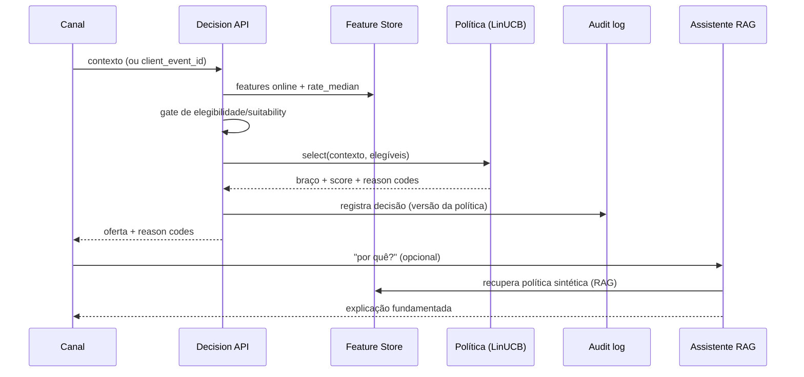

# System Card — Adaptive Offers Platform

> Visão de **sistema**: escopo, fluxo de decisão, dependências, guardrails,
> cenários de risco e plano de monitoramento. Complementa o `model-card.md`.

## 1. Escopo
Plataforma de experimentação adaptativa que decide, por contexto, qual oferta
apresentar em canais digitais, com assistente LLM/RAG para explicação e
governança. **Protótipo acadêmico** — não prod regulada.

## 2. Fluxo de decisão

## 3. Dependências
- **Internas**: feature store, catálogo de ofertas, registry de políticas (MLflow).
- **Externas (Azure)**: Azure OpenAI + AI Search (assistente), Redis (online),
  ADLS (offline), Key Vault (segredos). Falha do LLM → *fallback* offline
  determinístico (a decisão **não** depende do LLM).

## 4. Guardrails
| Guardrail | Mecanismo |
|---|---|
| Elegibilidade/suitability | Gate antes da seleção; `no_offer` sempre disponível |
| Exploração responsável | Piso mínimo; exploração só entre elegíveis |
| Auditabilidade | Reason codes + log por decisão + versão da política |
| Validação de entrada | Schema Pydantic (limites de idade/euribor/canal) |
| Reversibilidade | `rollback()` da política ativa |

## 5. Cenários de risco e mitigação
| Risco | Vetor | Mitigação |
|---|---|---|
| **Reward hacking** | braço maximiza margem ignorando elegibilidade | Gate de elegibilidade + monitor de reward + controle |
| **Manipulação de contexto** | input forjado p/ forçar oferta restrita | Validação de schema/limites + elegibilidade server-side |
| **Abuso do assistente** | prompt injection p/ vazar/inventar política | LLM só responde com *grounding* RAG; *fallback* determinístico; sem dados pessoais no corpus |
| **Violação de suitability** | oferta inadequada ao perfil | Regras de suitability + humano no loop em casos sensíveis |
| **Exclusão de segmento** | drift que nega ofertas a um grupo | Fairness no *gate* + monitor de mix por segmento |

## 6. Plano de monitoramento
- **Drift** (PSI/KS) de features e *score* — alerta em PSI ≥ 0,25.
- **Reward/conversão** — *control chart* (z < −3 → rollback/review).
- **Fairness** — disparidade de exposição por segmento, contínua.
- **Operacional** — latência, erro 4xx/5xx, saúde do feature store (`/health`).
- **Telemetria** em Application Insights; alertas acionam o *approval gate* de
  retreino (ver `docs/mlops-lifecycle.md`).

## 7. Resposta a incidentes
1. Alerta (drift/reward/fairness) → congelar promoção.
2. `rollback()` para versão estável; decisões voltam a baseline/humano.
3. Investigar com logs auditáveis; atualizar model/system card.
4. Reentrar no ciclo de retreino com nova evidência.

## 8. Revisão periódica
Trimestral ou por alerta; responsáveis e cadência iguais aos do `model-card.md`.
